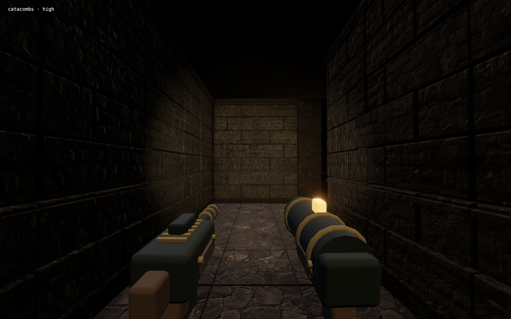
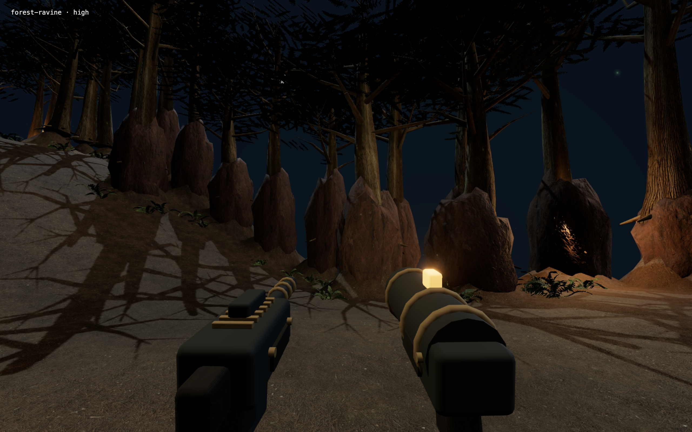
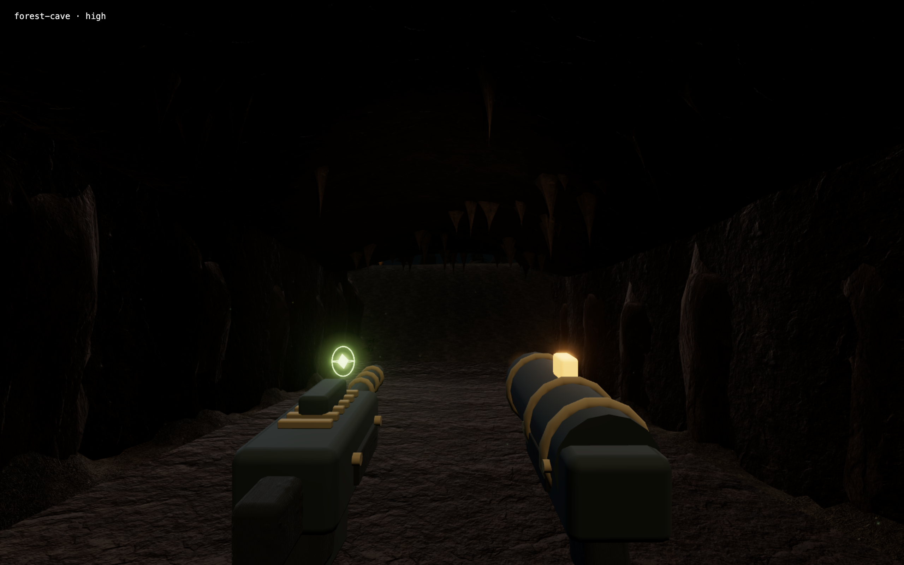

# Räumliche Tiefe – Prüfbericht

Stand: 16. September 2026. Die finale Darstellung wurde in zwölf nativen Grafikansichten und vier Messungen des großen Waldes geprüft. Es traten keine JavaScript-, Konsolen- oder Shaderfehler auf. Die vollständigen Messwerte mit Kamerapositionen und Aufnahmezeiten stehen in [depth-metrics.json](depth-metrics.json).

## Änderungen und sichtbares Ergebnis

- **Architektur:** Einzelne Steinlagen mit vertieften Mauerfugen, abgeschrägte Pflasterkanten, Gewölberippen und abgestützte Holzportale geben Wänden, Böden und langen Gängen eigene räumliche Konturen. Durchgehende Deckenkappen und Sockel schließen die zuvor sichtbaren blauen Spalten an den Wandanschlüssen. Quellen: [Mauer- und Gewölberelief](../src/world-relief.js), [Grundgeometrien](../src/architecture.js).
- **Wald und Höhlen:** Die Schlucht verläuft geschwungen und fällt tiefer ab; Felswände, Boden und Höhlen bilden zusammenhängende Volumen. Beide Höhlentypen besitzen gewölbte Decken und offene Zugänge. Die Geometrie verwendet dieselben Höhenfunktionen wie Bewegung und Geschosskollision. Quellen: [Gelände und Kollision](../src/forest-world.js), [Waldgeometrie](../src/forest-renderer.js), [Simulation](../src/simulation.js).
- **Licht und Luft:** Seitlich versetzte Taschenlampe, gerichtetes Mondlicht, örtliche Fackelbeleuchtung und Schatten modellieren nahe Oberflächen. Kontaktverschattung und höhenabhängiger Nebel staffeln Vordergrund, mittlere Entfernung und Hintergrund. Waffen werden nach dem Nebeldurchgang gezeichnet und bleiben klar. Quellen: [Renderer](../src/renderer.js), [Tiefen- und Höhennebel](../src/depth-atmosphere.js).
- **Kamera:** Das vertikale Sichtfeld beträgt 74°, beim Sprinten 81°. Die Waffenprojektion verwendet weiterhin die aktuelle Kamera. Quelle: [Waffenprojektion](../src/weapon-aim.js).

Die finalen Aufnahmen zeigen geschlossene Wandanschlüsse, deutliche Schatten auf den Schluchthängen und lesbare Höhlenwände. Die Höhlendecke bleibt dunkel; die Tropfsteine zeichnen sich als Silhouetten ab. Transparente Pflanzenkarten erzeugen keine rechteckigen Kontaktverschattungen.

### Katakomben

Mauerfugen, Sockel und Deckenanschlüsse; keine blauen Spalten zwischen Wand und Decke.

### Waldschlucht

Abfallender Boden, geschwungene Felshänge und Schatten der Bäume erzeugen sichtbare Höhen- und Entfernungsunterschiede.

### Felshöhle

Gewölbte, dunkle Decke mit Tropfsteinen; Boden und seitliche Felsflächen bleiben erkennbar.

## Messverfahren

Nativer Electron auf dem lokalen macOS-Rechner, 1280 × 800 logische Pixel, Gerätedichte 2. Der Renderer verwendet in **Hoch einen Pixelfaktor von 1,35**, in **Ausgeglichen 1,0**. Frühere Hoch-Messungen verwendeten 1,5; ein Vergleich mit diesen Werten erfolgt daher nicht bei gleicher Renderauflösung. Die Screenshots stammen aus derselben finalen Quellfassung über einen temporären Testaufbau mit den regulären Spielmodulen. Die Kamera wurde gezielt an Prüfpositionen gesetzt; die Aufnahmen ersetzen keinen Begehbarkeitstest.

Alle Ansichten verwenden den Welt-Code `DEPTH-2026`, eine Ebene sowie Maschinengewehr und Raketenwerfer. Die sechs Ansichten bei Größe 25 × 25 wurden in beiden Grafikstufen mit ruhiger Gefahr und stehender Kamera gemessen. Nach 650 ms Einschwingzeit wurden 60 Animationsbild-Aufrufe erfasst; der erste Zeitraum wurde verworfen. Rendering und visuelle Animation liefen weiter, die Spielsimulation stand für diese Vergleichsansichten still.

FPS ist der Kehrwert der mittleren Bildzeit. Das 95. Perzentil bezeichnet eine Bildzeit, die etwa 95 % der erfassten Intervalle nicht überschreiten. Diese kurzen Messungen gelten für die geprüften Ansichten auf diesem Rechner; sie sind keine hardwareunabhängige Leistungszusage. Werte um 120 FPS liegen nahe dem hier beobachteten Anzeigetakt.

## Finale Ansichten: 25 × 25

| Ansicht | Hoch FPS | Hoch p95, ms | Ausgeglichen FPS | Ausgeglichen p95, ms |
| --- | ---: | ---: | ---: | ---: |
| Katakomben | 66,8 | 17,1 | 120,4 | 10,0 |
| Ruinen | 66,8 | 17,5 | 119,6 | 10,3 |
| Mine | 60,5 | 25,1 | 120,0 | 8,6 |
| Wald am Start | 40,6 | 26,5 | 97,0 | 17,4 |
| Waldschlucht | 54,4 | 25,4 | 120,0 | 8,9 |
| Felshöhle | 41,4 | 26,7 | 120,0 | 9,5 |

Erfasst am 16. September 2026 zwischen 11:48:19 und 11:48:50 UTC. Räumlich gruppierte Geometrie erlaubt dem Renderer, nicht sichtbare Waldabschnitte und Architekturgruppen auszulassen. Die Messdaten enthalten zusätzlich die Zeichenaufrufe und Dreiecke eines zusammengesetzten Bildes einschließlich der zusätzlichen Renderdurchgänge.

## Großer Wald: 51 × 51 mit acht Gegnern

Normale Gefahr wurde am geschützten Startpunkt zunächst **60 Spielsekunden** simuliert. Dadurch erschienen regulär acht Wölfe und Orks; die Spielfigur blieb bei 100 Gesundheit. Ihre Positionen wurden nicht vor die Kamera verschoben. Während der Messungen liefen die Simulation und die Gegner-KI weiter. Pro Messung wurden nach 650 ms Einschwingzeit 180 Animationsbild-Aufrufe erfasst, davon 179 Intervalle ausgewertet.

Nach 60 Sekunden war das reguläre Ereignis zum Erlöschen der Fackeln aktiv. Zusätzlich wurde im temporären Testaufbau dieses Ereignis aufgehoben und ein zweites Fenster mit eingeschalteter Umgebungsbeleuchtung gemessen. Diese zweite Messung änderte keine Produktdatei.

| Zustand | Hoch FPS | Hoch p95, ms | Ausgeglichen FPS | Ausgeglichen p95, ms |
| --- | ---: | ---: | ---: | ---: |
| Reguläres Fackel-Ereignis nach 60 Sekunden | 63,0 | 17,6 | 120,0 | 8,4 |
| Zusätzliche Messung mit Beleuchtung | 41,2 | 32,7 | 91,0 | 17,1 |

Mit Beleuchtung wurden in Hoch 1.320 Zeichenaufrufe und 6.986.771 Dreiecke, in Ausgeglichen 1.212 Aufrufe und 6.157.955 Dreiecke für ein zusammengesetztes Bild erfasst. Diese Zahlen enthalten Mehrfachzeichnungen für Schatten und Nachbearbeitung. Acht Gegner und 100 Gesundheit blieben in allen vier Stichproben erhalten; keine Konsolen- oder Shaderfehler. Erfasst zwischen 11:52:58 und 11:53:12 UTC.

## Automatisierte Prüfungen und Freigabestand

- **126 von 126 Node-Tests bestanden.** Relevante Prüfungen: [Wandrelief und geschlossene Anschlüsse](../tests/world-relief.test.js), [Waldgeometrie](../tests/forest-renderer.test.js), [Gelände, Höhlen und Bewegung](../tests/forest.test.js), [Waffenprojektion](../tests/weapon-aim.test.js).
- **Vier Browserprüfungen gegen den frischen Produktionsbuild bestanden**, Gesamtdauer 31,7 Sekunden, ohne Browser- oder Konsolenfehler. Geprüft wurden unabhängiges Mausziel und Tastaturdrehung einschließlich Pause; Trackpad-Fallback, Randbegrenzung und Fenstergrößenänderung; gespeicherte Waldplanung; echte Tastaturbewegung zum Elfenlager mit Nachschub, Karte und Expeditionsbuch. Quellen: [Zielsteuerung](../tests/e2e/aim.spec.js), [Waldabläufe](../tests/e2e/forest.spec.js).
- **Produktionsbuild erfolgreich.** Vite meldete den bestehenden Hinweis zum redundanten dynamischen Import von `forest-creatures`; kein Buildfehler.
- **Paketierte macOS-App auf Apple Silicon nativ geprüft**, 1280 × 800 logische Pixel, Hoch, ohne JavaScript- oder Konsolenfehler. Echte W/D-Bewegung zum Elfenlager, Q/R zum Feuern, Nachschub, Karte, Buch und Pause funktionierten. Im selben Prozess wurden Wald → Katakomben → Leiter zur zweiten Ebene → Wald geprüft. Die Ad-hoc-Signatur bestand `codesign --verify --deep --strict`. Aufnahmen aus der regulären Bedienoberfläche: [Planung](screenshots/depth-planner.png), [Spielansicht](screenshots/depth-gameplay.png), [Elfen-Nachschub](screenshots/depth-elf-resupply.png).

Eine native Windows-Ausführung war nicht Teil dieser Grafikprüfung.
